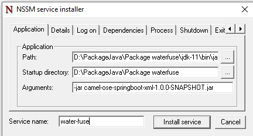

# To config FTP 

To change ftp config to sync data, in file `src/resources/spring/camel-context.xml`

- in `_route3` id, can change anything bellow

  - see `...uri="ftp:FTP_ADMIN@103.166.182.190:21/?password=Abc@1234..."` , 
  - FTP_ADMIN is account name 
  - 103.166.182.190 is IP
  - 21 is port
  - password= ... is password

For more detail of Camel Ftp can see [`@FtpCamel`](https://camel.apache.org/components/3.18.x/ftp-component.html) 

## To change config of database

In file `src/main/resources/application.properties`

```shell
spring.datasource.url=jdbc:sqlserver://103.166.182.190;database=SonLaEnv
spring.datasource.username=water
spring.datasource.password=tnmtsl@123
```

Can change config of IP, database and username, password, anything you want

## To build project

- Make sure your computer have `jdk 11` and `maven`
- Run script
  
```shell
mvn package
```

- output file ís in `target/camel-ose-springboot-xml-1.0.0-SNAPSHOT.jar`

## To install in windows as service using nssm

- Make sure you have nssm in your computer, and in your folder will have like this
- 
- run `nssm.exe install` in folder win64 or win32 This will open the Service Installer

- The Path parameter is where the path to you java.exe will go
- 
- The Startup Directory needs to be changed. It should point to the target folder which contain `camel-ose-springboot-xml-1.0.0-SNAPSHOT.jar` file.
- 
- Change Arguments follow: `-jar camel-ose-springboot-xml-1.0.0-SNAPSHOT.jar`
- 
- Add service name and click install service

